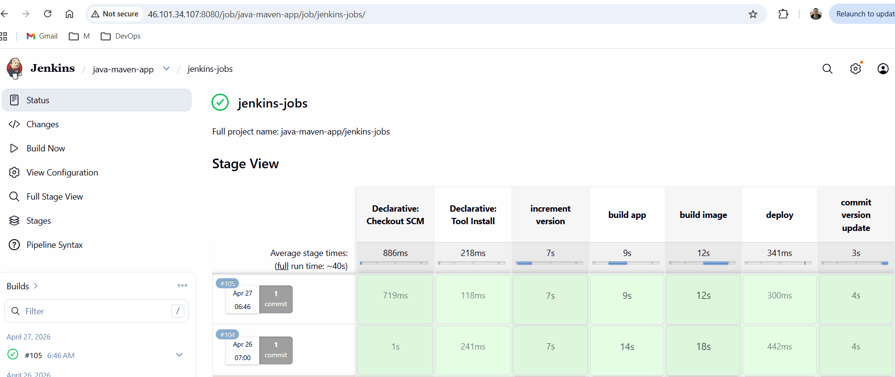
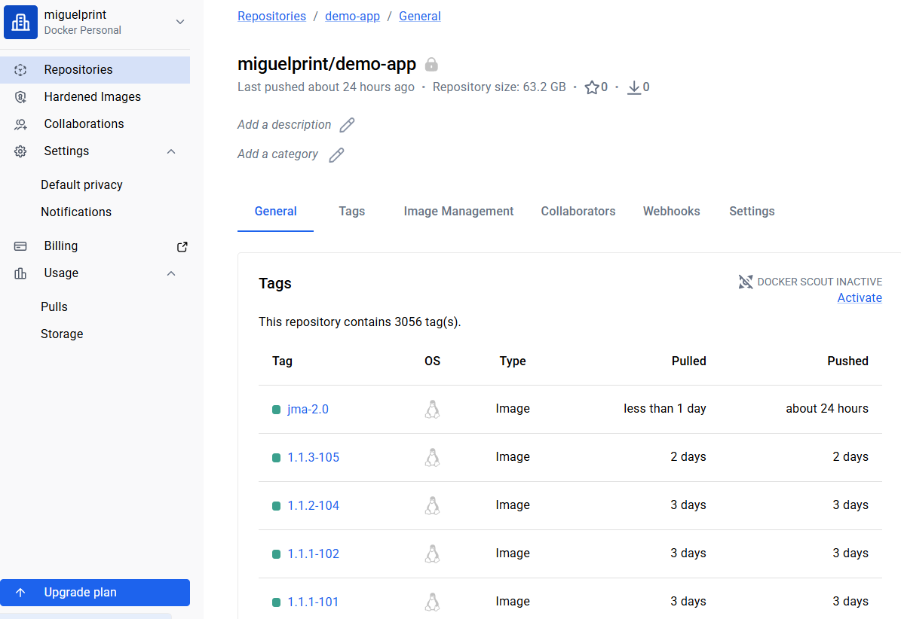

### 🚀 Production-Style CI/CD Deployment Pipeline on AWS EC2

Automated Jenkins pipeline for building, versioning, containerizing, and deploying applications to AWS EC2 with real-world operational troubleshooting, Git recovery, Docker lifecycle management, and remote deployment automation.

---

#### 📌 Project Overview

This project demonstrates a production-oriented CI/CD workflow designed to reduce manual deployment effort and improve deployment consistency.

The pipeline automates:

* Maven application builds
* Automated version incrementing
* Docker image creation & tagging
* Docker Hub image publishing
* Remote container deployment to AWS EC2
* Jenkins multibranch pipeline execution
* Secure SSH-based deployment automation
* Operational recovery from failed deployments

Unlike tutorial-only implementations, this project includes real deployment failures encountered during development and the troubleshooting process used to stabilize the pipeline.

---

#### 💼 Business Problem

Manual deployments introduce several operational risks:

* Inconsistent deployments across environments
* Slow release cycles
* Human deployment errors
* Difficulty recovering failed deployments
* Lack of deployment traceability
* Environment drift between servers

This project solves those problems by implementing an automated CI/CD deployment pipeline that delivers repeatable and traceable application deployments.

---

#### ⚙️ DevOps Engineering Value

This project demonstrates practical DevOps engineering capabilities across:

* CI/CD automation
* Jenkins Pipeline as Code
* Cloud infrastructure management
* Docker containerization
* Git branch recovery
* Secure remote deployments
* Infrastructure troubleshooting
* Deployment consistency
* Operational debugging

The implementation focuses on deployment reliability, operational troubleshooting, and recovery from real-world failure scenarios.

---

#### 🏗️ Architecture

```text
GitHub Repository
        ↓
Webhook Trigger
        ↓
Jenkins Multibranch Pipeline
        ↓
Maven Build & Version Increment
        ↓
Docker Build & Tagging
        ↓
Docker Hub Registry
        ↓
SSH Deployment to AWS EC2
        ↓
Running Docker Container
```

---

#### ☁️ AWS Infrastructure

#### AWS Services Used

| Service         | Purpose                   |
| --------------- | ------------------------- |
| Amazon EC2      | Application hosting       |
| IAM             | Access management         |
| Security Groups | Network access control    |
| SSH Key Pairs   | Secure remote access      |
| AWS CLI         | Infrastructure management |

---

#### ⚙️ Tech Stack

| Area                   | Technologies      |
| ---------------------- | ----------------- |
| CI/CD                  | Jenkins           |
| Cloud                  | AWS EC2           |
| Build Tool             | Apache Maven      |
| Containerization       | Docker            |
| Source Control         | Git & GitHub      |
| Language               | Java              |
| Runtime                | Spring Boot       |
| Remote Access          | SSH               |
| OS                     | Amazon Linux 2023 |
| Infrastructure Tooling | AWS CLI           |
| IDE                    | VS Code           |

---

#### 📂 Repository Structure

```bash
aws-devops-pipeline/
│
├── Jenkinsfile
├── pom.xml
├── Dockerfile
├── docker-compose.yaml
├── README.md
├── src/
└── assets/
```

---

#### 🔄 CI/CD Pipeline Workflow

#### 1️⃣ Source Control Integration

* GitHub repository connected to Jenkins Multibranch Pipeline
* Feature branches automatically discovered
* Pipeline triggered automatically through GitHub webhooks
* Branch isolation used for safer pipeline testing

Example branches:

```bash
feature/payment
jenkins-jobs
master
starting-code
```

---

#### 2️⃣ Automated Maven Build & Version Management

#### Successful Pipeline Execution

The final pipeline successfully completed all stages including version management, application build, Docker image creation, and deployment.



The Jenkins pipeline uses Maven to automate application compilation, testing, packaging, and version management.

Build execution includes:

- Dependency resolution
- Automated test execution
- Application packaging
- Build validation
- Automated version management

A key enhancement in this project was integrating automated version incrementing directly into the CI/CD workflow.

During pipeline execution, Maven parses the current application version, increments it automatically, and commits the updated version back to the repository. This ensures that every build produces uniquely identifiable artifacts and Docker images.

The pipeline performs the following version management tasks:

- Parse the current Maven version
- Increment application versions automatically
- Commit updated versions to Git
- Push version changes through Jenkins automation

This approach improves:

Build traceability
Deployment consistency
Release management
Artifact tracking

Example Maven commands used:

```bash
mvn build-helper:parse-version versions:set \
-DnewVersion=$VERSION.$BUILD_NUMBER \
versions:commit
```

By integrating version management directly into the build process, deployments become more reliable, repeatable, and easier to track across Docker images and AWS-hosted environments.

---

#### 3️⃣ Docker Image Build & Tagging

Docker images are built automatically during Jenkins execution.

Example build:

```bash
docker build -t miguelprint/my-app:1.0 .
```

Images are tagged with deployment versions for traceability.

Example image tags:

```bash
miguelprint/demo-app:java-maven-1.0
miguelprint/demo-app:java-maven-2.0
```

The project also included a containerized Node.js application that was used to validate the Docker build, registry integration, and AWS deployment workflow.

The application consisted of:

* Express.js backend services
* MongoDB database integration
* Dockerized application runtime
* Simple web interface for deployment verification

This application served as a deployment target throughout the project and was used to validate:

* Docker image creation and tagging
* Docker Hub image publishing
* Container deployment to AWS EC2
* Remote host connectivity
* Jenkins deployment automation

Using a real application instead of a simple "Hello World" container provided a more realistic deployment scenario and helped identify operational issues during image management, container lifecycle operations, and remote deployments.

---

#### 4️⃣ Docker Registry Integration

#### Docker Hub Images

Docker images were versioned and pushed to Docker Hub to support repeatable deployments across environments.



Docker images were pushed to Docker Hub for deployment consistency across environments.

This allows:

* Centralized image storage
* Consistent deployments
* Remote image pulls from EC2
* Immutable deployment artifacts

---

#### 5️⃣ AWS EC2 Deployment

The Jenkins pipeline deploys containers remotely to AWS EC2 using SSH credentials stored securely in Jenkins.

Deployment automation includes:

* SSH connection to EC2
* Pulling updated Docker images
* Stopping existing containers
* Starting updated containers
* Port mapping configuration
* Container cleanup operations

Example deployment target:

```bash
ec2-user@<ec2-host>
```

The EC2 environment was configured with:

* Amazon Linux 2023
* Docker Engine
* Docker Compose
* Security groups
* SSH key authentication

---

#### 🔐 Jenkins Credentials & Security

The pipeline uses Jenkins Credentials Management instead of hardcoded secrets.

Configured credentials included:

* Docker Hub credentials
* EC2 SSH private key
* Git authentication

This follows basic DevOps security practices by separating credentials from application code.

---

#### 🧪 Real-World Operational Troubleshooting

One of the strongest parts of this project was handling production-style deployment failures.

The focus was not only pipeline creation, but also operational recovery and infrastructure troubleshooting.

---

#### ❌ Challenge 1 — Git Upstream Tracking Misconfiguration

#### Problem

After cloning the repository, multiple branches incorrectly tracked `upstream` instead of `origin`.

This caused:

* Incorrect push targets
* Branch divergence
* Merge confusion
* Jenkins pipeline inconsistencies

#### Example Symptoms

```bash
upstream/jenkins-jobs
origin/jenkins-jobs
```

#### Resolution

Recovered repository state using:

```bash
git reflog --oneline
git reset --hard
git push --force-with-lease
```

This stabilized the Jenkins multibranch pipeline and restored the correct Git branch state.

---

#### ❌ Challenge 2 — Docker Image & Container Conflicts

#### Problem

Multiple stopped containers and outdated Docker images created deployment conflicts.

Example error:

```bash
image is being used by stopped container
```

This caused:

* Deployment failures
* Environment inconsistency
* Disk usage growth
* Image cleanup issues

#### Resolution

Performed Docker cleanup and lifecycle management:

```bash
docker rm <container-id>
docker rmi -f <image-id>
docker ps -a
docker images
```

This restored deployment consistency on the EC2 instance.

---

#### ❌ Challenge 3 — Port Allocation Failures

#### Problem

Deployment attempts failed because ports were already allocated by existing containers.

Example:

```bash
Bind for 0.0.0.0:3080 failed: port is already allocated
```

#### Resolution

* Identified conflicting containers
* Removed stale containers
* Corrected Docker port mappings
* Restarted deployment

This restored successful application deployment.

---

#### ❌ Challenge 4 — Jenkins Deployment Failures

#### Problem

The deploy stage initially failed due to:

* Incorrect Docker image references
* Remote deployment conflicts
* SSH deployment issues
* Git branch tracking problems

#### Resolution

The pipeline was corrected and successfully rebuilt.

Final successful stages:

* Checkout SCM
* Test
* Build
* Deploy

The final pipeline execution completed successfully after stabilizing Git tracking and Docker deployment logic.

---

#### 🐳 Docker Operations Performed

#### Running Containers

```bash
docker ps
```

#### Remove Stopped Containers

```bash
docker rm <container-id>
```

#### Remove Docker Images

```bash
docker rmi -f <image-id>
```

#### Verify Running Services

```bash
docker ps -a
docker images
```

---

#### 🌐 Networking & Infrastructure Concepts Practiced

This project also included foundational AWS networking and infrastructure concepts:

* CIDR notation
* Subnetting
* Security groups
* EC2 networking
* Port exposure
* SSH connectivity
* AWS CLI infrastructure management

Example concepts practiced:

```text
10.0.0.0/16
10.0.1.0/24
```

---

#### 📈 DevOps Concepts Demonstrated

This project demonstrates practical implementation of:

* CI/CD Automation
* Jenkins Pipeline as Code
* Automated Versioning
* Docker Containerization
* AWS EC2 Deployments
* Git Branch Recovery
* Infrastructure Troubleshooting
* Remote Deployment Automation
* Container Lifecycle Management
* Secure Credential Management
* Build Automation
* Docker Registry Integration

---

#### 🔮 Future Improvements

Planned next steps:

* Push images to AWS ECR
* Kubernetes deployment with Amazon EKS
* Infrastructure as Code with Terraform
* Jenkins Shared Libraries
* Monitoring with Prometheus & Grafana
* Blue/Green deployments
* Automated rollback strategies
* GitOps deployment workflows

---

#### 👨‍💻 Author

**Miguel — DevOps Engineer**

Focused on building production-oriented DevOps projects involving CI/CD automation, cloud infrastructure, Docker containerization, and operational troubleshooting.

---

#### 📚 Learning Source

This project was built while completing the AWS Services section of the DevOps Bootcamp by TechWorld with Nana.

The implementation extends the original exercises through additional debugging, deployment recovery, Git troubleshooting, infrastructure management, and production-style operational practices.

---

#### 📎 Project Highlights

* Automated Jenkins deployment pipeline
* AWS EC2 remote deployments
* Docker image lifecycle management
* Automated Maven versioning
* Git branch recovery & troubleshooting
* Jenkins multibranch pipeline setup
* Real operational debugging experience
* Production-style deployment workflow
